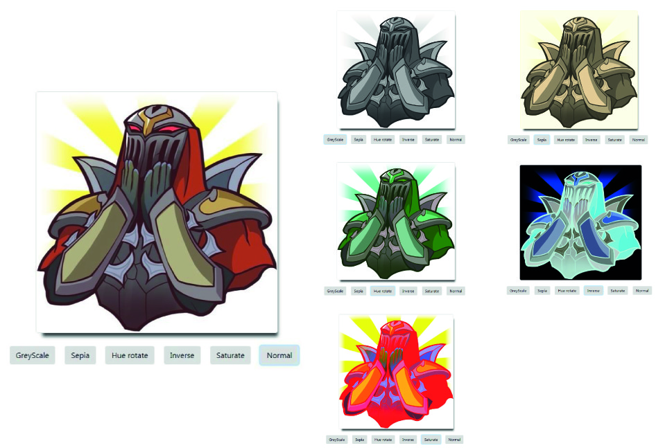

# Filter: plugin para imágenes

Plugin que permitirá aplicar filtros en imágenes, estos están definidos como:

+ Gray scale: cambiará la imagen a una escala de grises.
+ Hue-rotate: rotará los colores de la imágen.
+ Sepia: cambiará la imagen al estilo Sepia, imitando las fotografías antiguas
+ Inverso: convertirá la fotografía a negativo.
+ Saturar: intensificará los colores de la imágen.

## Para empezar

## Dependencias
#### Dependencias de producción
+ Bootstrap 4.0.0

#### Dependencias de desarrollo
+ chai-dom 1.7.0
+ jsdom 11.6.1
+ mocha 5.0.0
+ bowserify 10.2.1

## Versión 
La versión de este plugin es el 1.0.0

## Licencia
Licencia ISC

#### Instrucciones de intalación: 
Deberás clonar este repositorio en tu máquina, para ello utilizarás el comando `git clone url-del-repositorio`: 
 [Github](https://github.com/gvillablanca/filter-library.git)
 
#### Para implementarlo:
Debemos crear un `
` y aplicarle un *id="mainContainer"*  el cual contendrá a nuestras imágenes. Las imágenes deberan contener el siguiente atributo *name="imgLol* 
 
## documentación del API

#### API(ejemplo)
`
>const chai = require('chai');
>
>const expect = chai.expect;
>
>const sum = require('../src/app-test.js');
`
